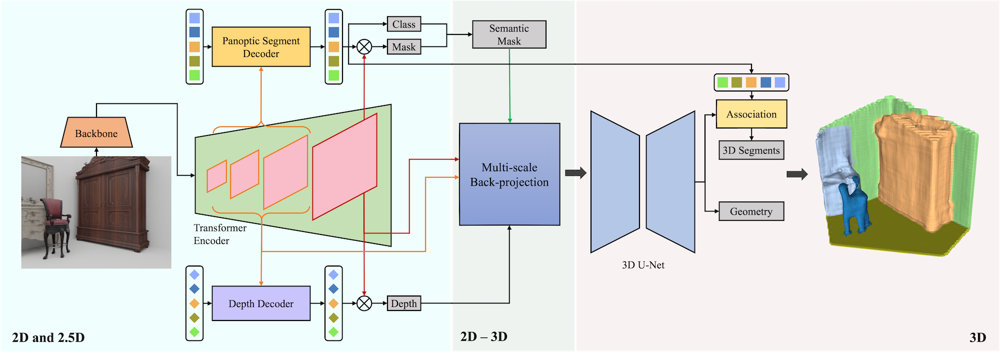

# Uni-3D: A Universal Model for Panoptic 3D Scene Reconstruction

[Xiang Zhang*](https://xzhang.dev), [Zeyuan Chen*](https://zeyuan-chen.com), [Fangyin Wei](https://weify627.github.io), and [Zhuowen Tu](https://pages.ucsd.edu/~ztu/) (\*Equal contribution)

This is the repository for the paper [Uni-3D: A Universal Model for Panoptic 3D Scene Reconstruction](https://openaccess.thecvf.com/content/ICCV2023/papers/Zhang_Uni-3D_A_Universal_Model_for_Panoptic_3D_Scene_Reconstruction_ICCV_2023_paper.pdf) (ICCV 2023).

[[`Paper`](https://openaccess.thecvf.com/content/ICCV2023/papers/Zhang_Uni-3D_A_Universal_Model_for_Panoptic_3D_Scene_Reconstruction_ICCV_2023_paper.pdf)]



## Codes

Coming soon


## Citation

Please consider citing Uni-3D if you find the work helpful.

```BibTeX
@InProceedings{Zhang_2023_ICCV,
    author    = {Zhang, Xiang and Chen, Zeyuan and Wei, Fangyin and Tu, Zhuowen},
    title     = {Uni-3D: A Universal Model for Panoptic 3D Scene Reconstruction},
    booktitle = {Proceedings of the IEEE/CVF International Conference on Computer Vision (ICCV)},
    month     = {October},
    year      = {2023},
    pages     = {9256-9266}
}
```